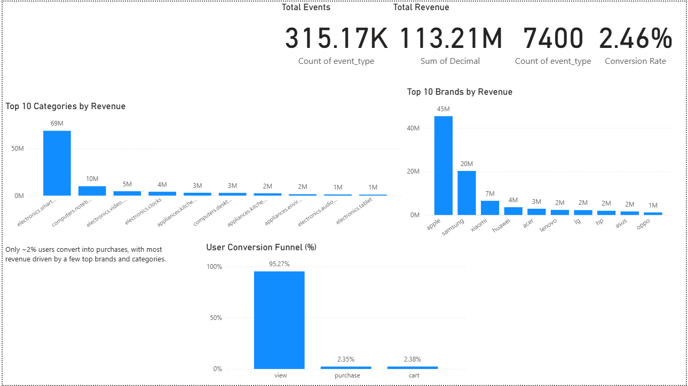

📊 E-commerce Customer Behavior Analysis
🔍 Overview

Analyzed an e-commerce dataset to understand user behavior, conversion funnel, and revenue patterns.

🛠 Tools Used
Python (Data Cleaning & Processing)
SQL (Data Analysis)
Power BI (Dashboard & Visualization)
📊 Key Analysis
User Conversion Funnel (View → Cart → Purchase)
Drop-off Analysis
Top Categories & Brands by Revenue
User Behavior Trends
📈 Key Insights
Only ~2% users convert into purchases
Majority users only view products (~95%)
Revenue is concentrated in a few top categories and brands
Significant drop-off observed in the conversion funnel
## 📸 Dashboard Preview  

💡 Business Impact

Helps identify user behavior patterns and optimize conversion strategies to improve business performance.
